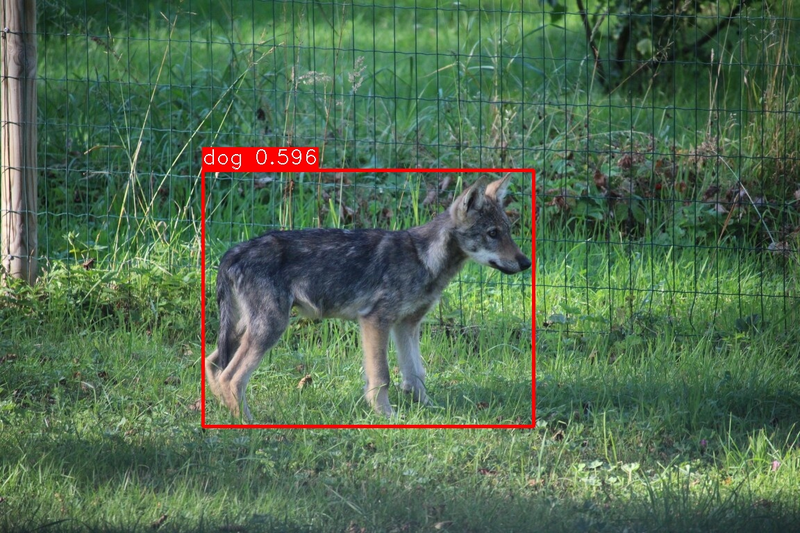

# Running YOLO v8 inference on AMD integrated GPUs

This is a simple example on how to run the [ultralytics/yolov8](https://pytorch.org/hub/ultralytics_yolov8/) and other inference models on the AMD ROCm platform with pytorch and also natively with MIGraphX.

I have an [ASRock 4x4 BOX-5400U](https://www.asrockind.com/en-gb/4X4%20BOX-5400U) mini computer with integrated AMD graphics. The integrated GPU is actually capable of running neural networks/pytorch. This here is an example/description on how to get it working.

Here we:
 * create a Docker image named `rocm-pytorch` that contains the ROCm and pytorch software environment
 * modify command line script `rocm_python` that runs this Docker image inline as a `python` wrapper
 * use this script to run the yolo5.py example script for inference on [wolf.jpg](wolf.jpg)
 * run the same image on the ultralytics/yolov8 trained using the Google Open Image V7 archive
 * export the yolov8n model from torch into AMD MIGraphX binary format and evaluate it

## Build a Docker image

As installing all the software is quite involved and there are many versions that conflict we resort to using containers instead. We build a Docker image named `rocm-pytorch` by running:

```
$ docker build -t rocm-pytorch .
```

See [Dockerfile](Dockerfile) for details. It is built on top of the prebuilt AMD/ROCm provided pytorch Docker image.

## Description of environment variables specified in the [rocm_python](rocm_python) script

AMD mini computers/laptops with integrated GPUs do not run out of the box but need special environment variables to work properly.

### `HSA_ENABLE_SDMA=0`

Without this the GPU memory transfers will silently hang/fail. Based on various internet forums it is because at this moment no consumer AMD motherboards with integrated GPUs support PCIe atomics. They are apparently needed for DMA memory transfers between the GPU and CPU. Why did AMD make the default setting for consumer level GPU-s to silently hang/crash? You need to ask them.

### `HSA_OVERRIDE_GFX_VERSION=9.0.0`

ROCm comes with precompiled/preoptimized kernel files and settings for some of their GPUs, but not for the one I have (gfx90c). To get this GPU working we need to fake the GPU version so that ROCm loads the more generic (but less optimized) kernels and settings instead. It seems to work, at least for my specific GPU (gfx90c).

You need to either delete this if yours is already supported or specify a version suitable for your GPU. You can find your current GPU name by running `rocminfo`:

```
$ rocminfo
...
*******
Agent 2
*******
  Name:                    gfx90c
  Uuid:                    GPU-XX
  Marketing Name:          AMD Radeon Graphics
...
```

See https://github.com/ROCm/ROCm/issues/1743#issuecomment-1149902796 for more examples for other GPUs.

Also you need ROCm version `5.7`. The current latest version `6.0.0` does not work (MIOpen fails to load).

## Run the example script:

As input file we use an image of a wolf:


We run the [yolo5.py](yolo5.py) script that runs inference on this image.

```
$ ./rocm_python yolo5.py
torch.cuda.is_available() True
torch.cuda.device_count() 1
torch.cuda.current_device() 0
torch.cuda.get_device_name(0) AMD Radeon Graphics
/opt/conda/envs/py_3.9/lib/python3.9/site-packages/torch/hub.py:294: UserWarning: You are about to download and run code from an untrusted repository. In a future release, this won't be allowed. To add the repository to your trusted list, change the command to {calling_fn}(..., trust_repo=False) and a command prompt will appear asking for an explicit confirmation of trust, or load(..., trust_repo=True), which will assume that the prompt is to be answered with 'yes'. You can also use load(..., trust_repo='check') which will only prompt for confirmation if the repo is not already trusted. This will eventually be the default behaviour
  warnings.warn(
Downloading: "https://github.com/ultralytics/yolov5/zipball/master" to /var/lib/jenkins/.cache/torch/hub/master.zip
YOLOv5 🚀 2024-1-19 Python-3.9.18 torch-2.2.0a0+gitd925d94 CUDA:0 (AMD Radeon Graphics, 512MiB)

Downloading https://github.com/ultralytics/yolov5/releases/download/v7.0/yolov5n.pt to yolov5n.pt...
100%|██████████████████████████████████████████████████████████████████████████████████████████████████████████████████████████████████| 3.87M/3.87M [00:01<00:00, 3.23MB/s]

Fusing layers...
YOLOv5n summary: 213 layers, 1867405 parameters, 0 gradients, 4.5 GFLOPs
Adding AutoShape...
image 1/1: 768x1152 1 dog
Speed: 7.7ms pre-process, 395.3ms inference, 134.9ms NMS per image at shape (1, 3, 448, 640)
Saved 1 image to runs/detect/exp
Benchmark: inference min 0.019536256790161133, median 0.020015954971313477
```

If you see what I see, it works. An illustrated image with detections will be generated under [./runs/detect/](./runs/detect/):


## Running ultralytics/yolov8

Ultralytics also offers pretrained yolov8 models but these have to be downloaded explicitly from their site and you need to use their API. See [yolo8.py](yolo8.py) for details. For a pretrained model using Google Open Image V7:

```
$ wget https://github.com/ultralytics/assets/releases/download/v8.1.0/yolov8n-oiv7.pt
$ ./rocm_python
Python 3.9.18 (main, Sep 11 2023, 13:41:44)
[GCC 11.2.0] :: Anaconda, Inc. on linux
Type "help", "copyright", "credits" or "license" for more information.
>>> from ultralytics import YOLO
>>> model = YOLO('yolov8n-oiv7.pt')
>>> from PIL import Image
>>> model.predict(Image.open('wolf.jpg'), save=True)

0: 448x640 1 Dog, 1 Plant, 24.1ms
Speed: 2.9ms preprocess, 24.1ms inference, 1.5ms postprocess per image at shape (1, 3, 448, 640)
Results saved to runs/detect/predict
```

This works fine on my hardware (gfx90c):


## Deploying for production using MIGraphX

We want to get rid of dependencies on pytorch and the ultralytics API-s. Basically we just want to use the model for inference, e.g. get a version suitable for deployment. We achieve this by first exporting the model into an interchange format (ONNX) and from there into the MIGraphX binary format:

```
$ wget https://github.com/ultralytics/assets/releases/download/v8.1.0/yolov8n.pt
$ ./rocm_python
Python 3.10.13 (main, Sep 11 2023, 13:44:35) [GCC 11.2.0] on linux
Type "help", "copyright", "credits" or "license" for more information.
>>> from ultralytics import YOLO
>>> model = YOLO('yolov8n.pt')
>>> model.export(format="onnx", opset=12, imgsz=[640, 640])
Ultralytics YOLOv8.1.3 🚀 Python-3.10.13 torch-2.0.1+gita61a294 CPU (AMD Ryzen 3 5400U with Radeon Graphics)
YOLOv8n summary (fused): 168 layers, 3151904 parameters, 0 gradients, 8.7 GFLOPs

PyTorch: starting from 'yolov8n.pt' with input shape (1, 3, 640, 640) BCHW and output shape(s) (1, 84, 8400) (6.2 MB)

ONNX: starting export with onnx 1.15.0 opset 12...
========== Diagnostic Run torch.onnx.export version 2.0.1+gita61a294 ===========
verbose: False, log level: Level.ERROR
======================= 0 NONE 0 NOTE 0 WARNING 0 ERROR ========================

ONNX: export success ✅ 0.5s, saved as 'yolov8n.onnx' (12.2 MB)

Export complete (2.0s)
Results saved to /opt/cwd
Predict:         yolo predict task=detect model=yolov8n.onnx imgsz=640
Validate:        yolo val task=detect model=yolov8n.onnx imgsz=640 data=coco.yaml
Visualize:       https://netron.app
'yolov8n.onnx'
>>>
```

We now have `yolov8n.onnx`. This can now be turned into a MIGraphX file:

```
$ ./rocm_python -c 'import os; os.system("/opt/rocm/bin/migraphx-driver compile ./yolov8n.onnx --optimize --gpu --enable-offload-copy --binary -o yolov8n.mxr")'
Compiling ...
Reading: ./yolov8n.onnx
```

This produces a file name `yolov8n.mxr` that can be used to evaluate image data:

```python
import cv2
import migraphx
import rocm_yolo_utils

# Load, scale and rearrange image data to be suitable for the model
image_data = rocm_yolo_utils.preprocess("wolf.jpg")

labels = [line.strip() for line in open("coco-labels.txt")]

# Load model and run inference on the image
model = migraphx.load("yolov8n.mxr")
input_name = next(iter(model.get_parameter_shapes()))
results = model.run({input_name: image_data["preprocessed_image"]})

# Merge and filter resulting boxes from the model output (`(1, 84, 8400)` float array)
boxes = rocm_yolo_utils.postprocess(image_data, results[0])

# Print out the found boxes
for box, class_id, confidence in boxes:
  print(f"{box[0]:.1f} {box[1]:.1f} {box[0]+box[2]:.1f} {box[1]+box[3]:.1f}: {labels[class_id]} {confidence:.3f}")

# Paint the found boxes on the original image and save it as output.jpg
cv2.imwrite("output.jpg", rocm_yolo_utils.paint_boxes(image_data["src_image"], boxes, labels))
```

This results in

```
292.3 245.5 767.7 613.9: dog 0.596
```

and illustrated image



Alternatively, we can use [rocm_yolo_utils.py](rocm_yolo_utils.py) directly from command line for the same effect (see `--help` for other arguments):

```
$ ./rocm_python rocm_yolo_utils.py --model yolov8n.mxr --benchmark wolf.jpg
Inference time: 0.020 s / 49.7 fps, preprocess 0.021 s, postprocess 0.002 s
292.3 245.5 767.7 613.9: dog 0.596
Written "output.jpg"
```

As you can see the performance I get on my `AMD Ryzen 3 5400U with Radeon Graphics` for yolov8n is about 50fps (0.02 seconds per image).

I hope this example was of help to you. Good luck!

